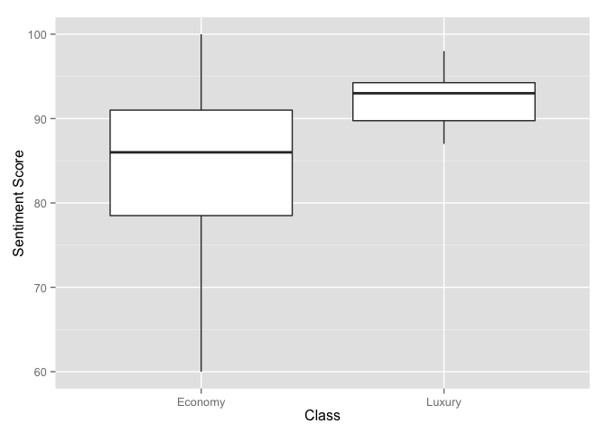

# The TwitteR Auto Sentiment Project
John Stanton-Geddes, Data Scientist, Dealer.com  
June 11, 2015  

In this report, I will demonstrate how we can use the R-language for statistical programming to address business needs. Specifically, I answer the question *to what extent do automotive brands vary in consumer sentiment on Twitter?* 

Besides the obvious interest of this question, I choose it because it uses open data from [Twitter](https://twitter.com/)), and highlights the integrated workflow of the R environment where I can collect, clean, analyze and present data all within the R environment. 

Below, I walk step-by-step through the code to explain how I collected and analyzed the data.

## R setup

The extensibility of R is demonstrated by the > 1,000 packages available on the [Comprehensive R Archive Network](http://cran.r-project.org/). This report was generated from the R source code using the `knitr` package. Each section ('chunk') of source code is shown in grey boxes, and the results are shown in white boxes. In this code chunk, I loaded the R packages necessary for the analysis.


```r
# knitr to generate report
library(knitr)

# for twitter API
library(httr)
library(httpuv)
#library(devtools)
#install_github("geoffjentry/twitteR")
library(twitteR)

# for word cloud
library(SnowballC)
library(tm)
library(wordcloud)
library(memoise)

# for data parsing
library(stringr)
library(plyr)

# for plots and tables
library(ggplot2)
library(pander)
```

## Data

I collected data from the Twitter [API](https://dev.twitter.com/overview/documentation) using the [TwitteR package](http://cran.r-project.org/web/packages/twitteR/). To do this, I had to set up a developer account, as explained in the [TwitteR vignette](http://geoffjentry.hexdump.org/twitteR.pdf), so I could authenticate my connection from this R session. 


```r
consumer_key <- readLines("consumer_key.key")
consumer_secret <- readLines("consumer_secret.key")
access_token <- readLines("access_token.key")
access_secret <- readLines("access_secret.key")

setup_twitter_oauth(consumer_key, consumer_secret, access_token, access_secret)
```

```
## [1] "Using direct authentication"
```

I pulled 1,000 tweets from the past week, English only, that mention (#) or are directed at (@) the Twitter handle of each of the major car brands. 


```r
# list of car brands, modified to their twitter account
# e.g. lincoln = lincolnmotorco
#brands <- list("Acura" = "acura", "Aston Martin" = "astonmartin", "Audi" = "audi", "Bentley" = "bentleymotors") # FOR TESTING
#brands <- list("acura", "astonmartin", "audi", "bentleymotors", "bmw", "buick", "cadillac")

brands <- list("acura", "astonmartin", "audi", "bentleymotors", "bmw", "buick", "cadillac", 
              "chevrolet", "chrysler", "dodge", "ferrari", "fiatontheweb", "ford", "ThisIsGMC", 
              "honda", "hyundai", "infinitiUSA", "isuzu", "jaguar", "jeep", "kia", "lamborghini", 
              "landrover", "lexus", "lincolnmotorco", "maserati", "mazdausa", "mclarenauto", 
              "mercedesbenz", "mini", "mitsucars", "nissan", "porsche", "ramtrucks", "rollsroyce", "scion",
              "subaru_usa", "teslamotors", "toyota", "vw", "volvocarglobal")

# function to get tweets in data.frame format for use in ldply
getTweets <- function(brand, n = 1000) {
  library(twitteR)
  
  TS <- paste0("@", brand, " OR ", "#", brand)
  # get tweets
  tweets <- searchTwitter(TS, n = n, since = format(Sys.Date()-7), lang="en")
  # strip retweets
  if(length(tweets)>0) {
    tweets <- strip_retweets(tweets, strip_manual = TRUE, strip_mt = TRUE)
    # convert to data.frame
    tweetdf <- twListToDF(tweets)
    # add brand and return
    out <- cbind(brand, tweetdf)
  } else {
    out <- structure(list(brand = structure(integer(0), .Label = c(brand), class = "factor"),
                               text = character(0), 
                               favorited = logical(0), 
                               favoriteCount = numeric(0), 
                               replyToSN = character(0), 
                               created = structure(numeric(0), class = c("POSIXct", "POSIXt"), tzone = "UTC"),
                               truncated = logical(0), replyToSID = character(0), 
                               id = character(0), 
                               replyToUID = character(0), 
                               statusSource = character(0), 
                               screenName = character(0), 
                               retweetCount = numeric(0), 
                               isRetweet = logical(0), 
                               retweeted = logical(0), 
                               longitude = character(0), 
                               latitude = character(0)), 
                          .Names = c("brand", "text", "favorited", "favoriteCount", "replyToSN", "created",  "truncated", "replyToSID", "id", "replyToUID", "statusSource", "screenName", "retweetCount", "isRetweet", "retweeted", "longitude","latitude"), row.names = integer(0), class = "data.frame")
  }
  
  return(out)
}

# use plyr to get tweets for all brands in parallel
tweets_by_brand <- ldply(brands, function(brand) getTweets(brand, n=1000))
```

```
## Warning in doRppAPICall("search/tweets", n, params = params,
## retryOnRateLimit = retryOnRateLimit, : 1000 tweets were requested but the
## API can only return 845
```

```
## Warning in doRppAPICall("search/tweets", n, params = params,
## retryOnRateLimit = retryOnRateLimit, : 1000 tweets were requested but the
## API can only return 157
```

```
## Warning in doRppAPICall("search/tweets", n, params = params,
## retryOnRateLimit = retryOnRateLimit, : 1000 tweets were requested but the
## API can only return 568
```

```
## Warning in doRppAPICall("search/tweets", n, params = params,
## retryOnRateLimit = retryOnRateLimit, : 1000 tweets were requested but the
## API can only return 138
```

```
## [1] "Rate limited .... blocking for a minute and retrying up to 119 times ..."
## [1] "Rate limited .... blocking for a minute and retrying up to 118 times ..."
## [1] "Rate limited .... blocking for a minute and retrying up to 117 times ..."
## [1] "Rate limited .... blocking for a minute and retrying up to 116 times ..."
## [1] "Rate limited .... blocking for a minute and retrying up to 115 times ..."
## [1] "Rate limited .... blocking for a minute and retrying up to 114 times ..."
## [1] "Rate limited .... blocking for a minute and retrying up to 113 times ..."
## [1] "Rate limited .... blocking for a minute and retrying up to 112 times ..."
## [1] "Rate limited .... blocking for a minute and retrying up to 111 times ..."
## [1] "Rate limited .... blocking for a minute and retrying up to 110 times ..."
## [1] "Rate limited .... blocking for a minute and retrying up to 109 times ..."
```

```
## Warning in doRppAPICall("search/tweets", n, params = params,
## retryOnRateLimit = retryOnRateLimit, : 1000 tweets were requested but the
## API can only return 382
```

```
## Warning in doRppAPICall("search/tweets", n, params = params,
## retryOnRateLimit = retryOnRateLimit, : 1000 tweets were requested but the
## API can only return 349
```

```
## Warning in doRppAPICall("search/tweets", n, params = params,
## retryOnRateLimit = retryOnRateLimit, : 1000 tweets were requested but the
## API can only return 894
```

```
## [1] "Rate limited .... blocking for a minute and retrying up to 119 times ..."
## [1] "Rate limited .... blocking for a minute and retrying up to 118 times ..."
## [1] "Rate limited .... blocking for a minute and retrying up to 117 times ..."
## [1] "Rate limited .... blocking for a minute and retrying up to 116 times ..."
## [1] "Rate limited .... blocking for a minute and retrying up to 115 times ..."
## [1] "Rate limited .... blocking for a minute and retrying up to 114 times ..."
## [1] "Rate limited .... blocking for a minute and retrying up to 113 times ..."
## [1] "Rate limited .... blocking for a minute and retrying up to 112 times ..."
## [1] "Rate limited .... blocking for a minute and retrying up to 111 times ..."
## [1] "Rate limited .... blocking for a minute and retrying up to 110 times ..."
```

```
## Warning in doRppAPICall("search/tweets", n, params = params,
## retryOnRateLimit = retryOnRateLimit, : 1000 tweets were requested but the
## API can only return 0
```

```r
str(tweets_by_brand)
```

```
## 'data.frame':	17033 obs. of  17 variables:
##  $ brand        : Factor w/ 41 levels "acura","astonmartin",..: 1 1 1 1 1 1 1 1 1 1 ...
##  $ text         : chr  "@Acura worst gps ever in the 2012 Acura TL" "Love taking pix with other cars, wanna take pix DM me.\nPhotog @worksproductionfilm\n#acura #acuransx #nsx #honda #s1… http://t"| __truncated__ "#Acura #RDX vs. #Lexus #NX. Which one do you like more?\nhttp://t.co/InLdUgwquu" "Acura Owners Club Join Free today at ... http://t.co/RcSytAqyt2    #Acura http://t.co/Ajl4SHTJcT" ...
##  $ favorited    : logi  FALSE FALSE FALSE FALSE FALSE FALSE ...
##  $ favoriteCount: num  0 1 0 0 0 1 0 5 0 0 ...
##  $ replyToSN    : chr  "Acura" NA NA NA ...
##  $ created      : POSIXct, format: "2015-08-19 16:13:07" "2015-08-19 16:07:31" ...
##  $ truncated    : logi  FALSE FALSE FALSE FALSE FALSE FALSE ...
##  $ replyToSID   : chr  NA NA NA NA ...
##  $ id           : chr  "634035374747201536" "634033963611389952" "634033628461199360" "634033518088224768" ...
##  $ replyToUID   : chr  "24277513" NA NA NA ...
##  $ statusSource : chr  "<a href=\"http://twitter.com/download/iphone\" rel=\"nofollow\">Twitter for iPhone</a>" "<a href=\"http://ifttt.com\" rel=\"nofollow\">IFTTT</a>" "<a href=\"http://twitter.com\" rel=\"nofollow\">Twitter Web Client</a>" "<a href=\"http://twitter.com\" rel=\"nofollow\">Twitter Web Client</a>" ...
##  $ screenName   : chr  "TheJayPaq" "InfinitiAgora" "060specs" "Acura_OC" ...
##  $ retweetCount : num  0 0 0 0 0 1 0 2 0 0 ...
##  $ isRetweet    : logi  FALSE FALSE FALSE FALSE FALSE FALSE ...
##  $ retweeted    : logi  FALSE FALSE FALSE FALSE FALSE FALSE ...
##  $ longitude    : chr  NA NA NA NA ...
##  $ latitude     : chr  NA NA NA NA ...
```

The warning tells me that for some of the car brands, there are no tweets. I may want to return and try a different search for these brands.

The `str` command shows the structure of the data, which included 17033 tweets, including the text of the message, when it was created, user ID, source, screen name, retweet information, and location information.

The text of the messages was messay, so I cleaned the tweets by removing any non-alphanumeric charaters, the @ and # phrases, and web links.


```r
# function to clean tweets
cleanTweet <- function(tweet, leaveout) {
  thistweet <- unlist(str_split(tweet, pattern = " "))
  # remove all non-alphanumeric characters
  thistweet <- str_replace_all(thistweet, "[^[:alnum:]]", " ")
  # convert to lowercase 
  thistweet <- tolower(thistweet)
  # remove brand as it swamps other words
  thistweet <- thistweet[!grepl(leaveout, thistweet)]
  # remove links
  thistweet <- thistweet[!grepl("http", thistweet)]
  # remove 'amp' which keeps showing up
  thistweet <- thistweet[!grepl("amp", thistweet)]
  # recombine and return
  paste(thistweet, collapse = " ")
}

# ddply to clean tweet text
tweets_by_brand <- ddply(tweets_by_brand, .(id), mutate, text_clean = cleanTweet(text, leaveout = brand[1]))
# drop 'text' because invalid characters cause problems with printing and such
tweets_by_brand <- subset(tweets_by_brand, , - text)

# save for later tests
save(tweets_by_brand, file = paste0("results/tweets_by_brand_", Sys.Date(), ".Rda"))
```

# Sentiment Analysis

Consumer sentiment about a brand is extremely important for sales, and also highly dynamic over time. I used the cleaned text from the tweets to determine if people (or at least, the biased sample of people using Twitter) have positive or negative sentiment about each brand. For this analysis, I used the method of Breen [2011](http://www.slideshare.net/jeffreybreen/r-by-example-mining-twitter-for) with the Hu & Liu [KDD-2004](http://www.cs.uic.edu/~liub/FBS/sentiment-analysis.html) opinion-lexicon.


```r
# load opinion lexicon
hu_liu_pos <- scan("data/opinion-lexicon-English/positive-words.txt", skip = 35, what = "character")
hu_liu_neg <- scan("data/opinion-lexicon-English/negative-words.txt", skip = 35, what = "character")

# add industry-specific terms...
pos_words <- c(hu_liu_pos, "highlife")
neg_words <- c(hu_liu_neg, "dammit", "recall", "safety", "crash", "accident", "malfunction")

# sentiment_score function
sentiment_score <- function(text, pos_words, neg_words) {
  library(stringr)
  # split text into words
  word_list <- str_split(text, '\\s+')
  # unlist
  words <- unlist(word_list)
    
  # compare rods to the dictionaries of positive and negative terms
  # return only those that are TRUE/FALSE
  pos_matches <- !is.na(match(words, pos_words))
  neg_matches <- !is.na(match(words, neg_words))
    
  # score. TRUE/FAlSE treated as 1/0 by sum()
  score <- sum(pos_matches) - sum(neg_matches)
  return(score)
}

# calculate sentiment score for each tweet
# identify very positive (sscore > 1) and negative (sscore < -1) tweets
tweets_by_brand <- ddply(tweets_by_brand, .(id), mutate, 
                        sscore = sentiment_score(text_clean, pos_words = pos_words, neg_words = neg_words),
                        very_pos = as.numeric(sscore > 1),
                        very_neg = as.numeric(sscore < -1))

#str(tweets_by_brand)

# summarise by brand
# ratio of positive (sscore > 1) to negative (sscore < -1) sentiment by brand
sscore_by_brand <- ddply(tweets_by_brand, 'brand', summarize, 
                        sscore_mean = mean(sscore),
                        sscore_sd = sd(sscore),
                        pos_count = sum(very_pos),
                        neg_count = sum(very_neg))

# overall sentiment score by brand as ratio of very positive to very negative tweets
sscore_by_brand <- mutate(sscore_by_brand, .(id), mutate,
                         sscore_overall = round(100 * pos_count/(pos_count + neg_count)))

# order
sscore_by_brand <- sscore_by_brand[order(sscore_by_brand$sscore_overall, decreasing = TRUE), ]
sscore_by_brand
```

```
##             brand sscore_mean sscore_sd pos_count neg_count sscore_overall
## 18          isuzu   0.3103448 0.6904793         4         0            100
## 5             bmw   0.7587065 2.8633006        46         1             98
## 26       maserati   0.4316239 1.4521725        35         2             95
## 19         jaguar   1.0320513 2.7475095        48         3             94
## 23      landrover   0.6904277 1.7594903        67         5             93
## 25 lincolnmotorco   0.5091743 0.8706204        28         2             93
## 29   mercedesbenz   0.3518006 0.8536219        27         2             93
## 35     rollsroyce   0.5864198 2.0558543        57         5             92
## 36          scion   0.5205725 1.0671986        65         6             92
## 11        ferrari   0.4668094 2.2023376        51         5             91
## 37     subaru_usa   0.4650000 1.0508551        29         3             91
## 12   fiatontheweb   0.4157303 0.9747842         9         1             90
## 14      ThisIsGMC   0.3562753 1.2665936        27         3             90
## 33        porsche   0.6957447 2.3122421        46         5             90
## 1           acura   0.6542553 1.8565199        31         4             89
## 17    infinitiUSA   0.4276316 1.1369879        17         2             89
## 24          lexus   0.6548673 2.4112446        72         9             89
## 28    mclarenauto   0.4000000 0.8902378        17         2             89
## 6           buick   0.4256560 1.0845353        91        13             88
## 30           mini   0.3653251 1.3501555        52         7             88
## 3            audi   0.4436090 1.9011245        26         4             87
## 7        cadillac   0.5662252 2.0248666        77        12             87
## 15          honda   0.4348442 1.0488108        60        10             86
## 20           jeep   0.4405594 1.4515012        46         8             85
## 4   bentleymotors   0.4066986 1.0479619        24         5             83
## 8       chevrolet   0.3120244 0.8997247        54        11             83
## 22    lamborghini   0.5363881 2.5374273        46        10             82
## 31      mitsucars   0.4297521 1.2029578        17         4             81
## 38    teslamotors   0.3482587 1.2204040        44        10             81
## 13           ford   0.2311902 0.9035159        37         9             80
## 16        hyundai   0.3297045 1.4851826        99        31             76
## 40             vw   0.3475783 1.8849748        36        12             75
## 34      ramtrucks   0.4111842 1.5281754        37        13             74
## 32         nissan   0.2233503 1.3419678        41        19             68
## 27       mazdausa   0.2951807 0.9149188        25        13             66
## 39         toyota   0.3457944 1.8404510        50        27             65
## 9        chrysler   0.0875000 1.1965920        47        30             61
## 21            kia   0.2045113 1.4291429        48        32             60
## 2     astonmartin   0.1488971 1.2355532        35        25             58
## 10          dodge   0.1033592 1.6507697        25        46             35
```

The rankings of car brands by Twitter consumer sentiment, according to tweets from the past week, are shown in this table. Many brands have only positive sentiment (no negative messages), but a few have sentiment at or below 50%. 

*Do luxury brands have more positive consumer sentiment than economy brands*


```r
luxury <- c('mercedesbenz', 'audi','bmw','jaguar','landrover', 'lexus', 'maserati', 'mercedes', 'porsche', 'tesla')
economy <- c('fiatontheweb', 'honda', 'hyundai', 'isuzu', 'kia', 'mazda','mitsucars', 'scion')

luxury_scores <- sscore_by_brand[which(sscore_by_brand$brand %in% luxury), "sscore_overall"]
economy_scores <- sscore_by_brand[which(sscore_by_brand$brand %in% economy), "sscore_overall"]

# t-test
t.test(luxury_scores, economy_scores)
```

```
## 
## 	Welch Two Sample t-test
## 
## data:  luxury_scores and economy_scores
## t = 1.7412, df = 6.786, p-value = 0.1265
## alternative hypothesis: true difference in means is not equal to 0
## 95 percent confidence interval:
##  -3.228796 20.835939
## sample estimates:
## mean of x mean of y 
##  92.37500  83.57143
```

```r
# plot
class_dat <- data.frame(
  class = c(rep("Luxury", 8), rep("Economy", 7)),
  score = c(luxury_scores, economy_scores)
)

ggplot(class_dat, aes(x=class, y=score)) + 
  geom_boxplot() +
  xlab("Class") +
  ylab("Sentiment Score")
```

 

As shown in the figure and supported by the *T*-test, there's no difference in consumer sentiment between the economy and luxury brands. 


## Word Cloud

The sentiment analysis provides a key metric for consumer satisifaction, but isn't informative to what the reasons are, and isn't visually interesting. To give greater insight on *what* people are saying about each car brand, I made word clouds for the top and lowest ranked automotive brands.


```r
tweets2wordcloud <- function(tweets) {
  library(tm)
  library(wordcloud)
  
  # turn tweets into a Corpus
  tweetCorpus <- Corpus(VectorSource(tweets))
  tweetCorpus <- tm_map(tweetCorpus, removePunctuation)
  tweetCorpus <- tm_map(tweetCorpus, removeNumbers)
  tweetCorpus <- tm_map(tweetCorpus, removeWords, stopwords("SMART"))
  
  myDTM <- TermDocumentMatrix(tweetCorpus,
                              control = list(minWordLength = 1))
  
  m <- as.matrix(myDTM)
  m <- sort(rowSums(m), decreasing=TRUE)
  
  wordcloud(names(m), m, scale = c(3, 0.5), 
          min.freq = 2, max.words = 50,
          colors=brewer.pal(8, "RdYlBu"))
  
}


# first 
first_tweets <- subset(tweets_by_brand, brand == sscore_by_brand[1, "brand"], select = c("brand", "text_clean"))
first_tweets <- droplevels(first_tweets)

tweets2wordcloud(first_tweets$text_clean)
```

 

```r
# last
last_tweets <- subset(tweets_by_brand, brand == sscore_by_brand[nrow(sscore_by_brand), "brand"], select = c("brand", "text_clean"))
last_tweets <- droplevels(last_tweets)

tweets2wordcloud(last_tweets$text_clean)
```

 

Make what you will from these superficial snap-shot word clouds.

Finally, I turned this analysis into an interactive Shiny web-app to share and allow for further investigation as time passes. The web is available at (https://ddcjstantongeddes.shinyapps.io/dmkt-twitter-auto-sentiment).


## Notes

This report was produced using RStudio.


```
## R version 3.1.2 (2014-10-31)
## Platform: x86_64-apple-darwin13.4.0 (64-bit)
## 
## locale:
## [1] en_US.UTF-8/en_US.UTF-8/en_US.UTF-8/C/en_US.UTF-8/en_US.UTF-8
## 
## attached base packages:
## [1] stats     graphics  grDevices utils     datasets  methods   base     
## 
## other attached packages:
##  [1] pander_0.5.1       ggplot2_1.0.1      plyr_1.8.3        
##  [4] stringr_1.0.0      memoise_0.2.1      wordcloud_2.5     
##  [7] RColorBrewer_1.1-2 tm_0.6             NLP_0.1-7         
## [10] SnowballC_0.5.1    twitteR_1.1.8      httpuv_1.3.2      
## [13] httr_0.6.1         knitr_1.8         
## 
## loaded via a namespace (and not attached):
##  [1] bit_1.1-12       bit64_0.9-4      bitops_1.0-6     colorspace_1.2-6
##  [5] DBI_0.3.1        digest_0.6.8     evaluate_0.5.5   formatR_1.0     
##  [9] grid_3.1.2       gtable_0.1.2     htmltools_0.2.6  labeling_0.3    
## [13] magrittr_1.5     MASS_7.3-35      munsell_0.4.2    parallel_3.1.2  
## [17] proto_0.3-10     R6_2.1.0         Rcpp_0.12.0      RCurl_1.95-4.6  
## [21] reshape2_1.4.1   rjson_0.2.15     rmarkdown_0.6.1  scales_0.2.5    
## [25] slam_0.1-32      stringi_0.5-2    tools_3.1.2      yaml_2.1.13
```

