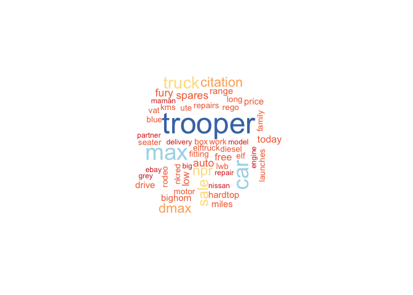
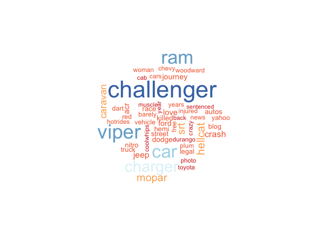

# The TwitteR Auto Sentiment Project
John Stanton-Geddes, Data Scientist 
 DMKT Product Analytics  
June 11, 2015  

The DMKT Product Analytics team provides the analysis for data-driven business decisions to improve the Dealer.com and Dealertrack product suite. To accomplish our work, we use our awesome proprietary data and the best available tools. Counter-intuitively, in recent years free open-source software tools, primarily R and Python, have gained ground on proprietary software for data analysis. In large part, this is because of the nature of the open-source community enabling much more rapid development of these tools.

In this report, I will demonstrate how we R-language for statistical programming to address business needs. Specifically, I answer the question *to what extent do car brands vary in consumer sentiment on Twitter?* 

Besides the obvious interest of this question, I choose it because it uses freely-available data from [Twitter](https://twitter.com/)), and highlights the integrated workflow of the R environment where I can collect, clean, analyze and present data all within the R environment. 

Below, I walk step-by-step through the code to explain how I collected and analyzed the data.

## R setup

The extensibility of R is demonstrated by the > 1,000 packages available on the [Comprehensive R Archive Network](http://cran.r-project.org/). This report was generated from the R source code using the `knitr` package. Each section ('chunk') of source code is shown in grey boxes, and the results are shown in white boxes. In this code chunk, I loaded the R packages necessary for the analysis.


```r
# knitr to generate report
library(knitr)
opts_chunk$set(cache=TRUE)

# for twitter API
library(httr)
library(httpuv)
#library(devtools)
#install_github("geoffjentry/twitteR")
library(twitteR)

# for word cloud
library(SnowballC)
library(tm)
library(wordcloud)
library(memoise)

# for data parsing
library(stringr)
library(plyr)

# for plots and tables
library(ggplot2)
library(pander)
```

## Data

I collected data from the Twitter [API](https://dev.twitter.com/overview/documentation) using the [TwitteR package](http://cran.r-project.org/web/packages/twitteR/). To do this, I had to set up a developer account, as explained in the [TwitteR vignette](http://geoffjentry.hexdump.org/twitteR.pdf), so I could authenticate my connection from this R session. 


```r
consumer_key <- readLines("consumer_key.key")
consumer_secret <- readLines("consumer_secret.key")
access_token <- readLines("access_token.key")
access_secret <- readLines("access_secret.key")

setup_twitter_oauth(consumer_key, consumer_secret, access_token, access_secret)
```

```
## [1] "Using direct authentication"
```

I pulled 1,000 tweets from the past week, English only, that mention (#) or are directed at (@) the Twitter handle of each of the major car brands. 


```r
# list of car brands, modified to their twitter account
# e.g. lincoln = lincolnmotorco
#brands <- list("Acura" = "acura", "Aston Martin" = "astonmartin", "Audi" = "audi", "Bentley" = "bentleymotors") # FOR TESTING
#brands <- list("acura", "astonmartin", "audi", "bentleymotors", "bmw", "buick", "cadillac")

brands <- list("acura", "astonmartin", "audi", "bentleymotors", "bmw", "buick", "cadillac", 
              "chevrolet", "chrysler", "dodge", "ferrari", "fiatontheweb", "ford", "ThisIsGMC", 
              "honda", "hyundai", "infinitiUSA", "isuzu", "jaguar", "jeep", "kia", "lamborghini", 
              "landrover", "lexus", "lincolnmotorco", "maserati", "mazdausa", "mclarenauto", 
              "mercedesbenz", "mini", "mitsucars", "nissan", "porsche", "ramtrucks", "rollsroyce", "scion",
              "subaru_usa", "teslamotors", "toyota", "vw", "volvocarglobal")

# function to get tweets in data.frame format for use in ldply
getTweets <- function(brand, n = 1000) {
  library(twitteR)
  
  TS <- paste0("@", brand, " OR ", "#", brand)
  # get tweets
  tweets <- searchTwitter(TS, n = n, since = format(Sys.Date()-7), lang="en")
  # strip retweets
  if(length(tweets)>0) {
    tweets <- strip_retweets(tweets, strip_manual = TRUE, strip_mt = TRUE)
    # convert to data.frame
    tweetdf <- twListToDF(tweets)
    # add brand and return
    out <- cbind(brand, tweetdf)
  } else {
    out <- structure(list(brand = structure(integer(0), .Label = c(brand), class = "factor"),
                               text = character(0), 
                               favorited = logical(0), 
                               favoriteCount = numeric(0), 
                               replyToSN = character(0), 
                               created = structure(numeric(0), class = c("POSIXct", "POSIXt"), tzone = "UTC"),
                               truncated = logical(0), replyToSID = character(0), 
                               id = character(0), 
                               replyToUID = character(0), 
                               statusSource = character(0), 
                               screenName = character(0), 
                               retweetCount = numeric(0), 
                               isRetweet = logical(0), 
                               retweeted = logical(0), 
                               longitude = character(0), 
                               latitude = character(0)), 
                          .Names = c("brand", "text", "favorited", "favoriteCount", "replyToSN", "created",  "truncated", "replyToSID", "id", "replyToUID", "statusSource", "screenName", "retweetCount", "isRetweet", "retweeted", "longitude","latitude"), row.names = integer(0), class = "data.frame")
  }
  
  return(out)
}

# use plyr to get tweets for all brands in parallel
tweets_by_brand <- ldply(brands, function(brand) getTweets(brand, n=100))
```

```
## Warning in doRppAPICall("search/tweets", n, params = params,
## retryOnRateLimit = retryOnRateLimit, : 100 tweets were requested but the
## API can only return 0
```

```r
str(tweets_by_brand)
```

```
## 'data.frame':	2146 obs. of  17 variables:
##  $ brand        : Factor w/ 41 levels "acura","astonmartin",..: 1 1 1 1 1 1 1 1 1 1 ...
##  $ text         : chr  "Road trip season is at hand &amp; you can drive w/ confidence in any of our #Acura models, 7/3-5! http://t.co/nU1tesZDfW http:/"| __truncated__ "#tbt to a #RL [#markham #acura #acuracanada #acuraRL #jdm #honda #legend #HondaLegend #paddleshifters… https://t.co/IflqooaPx6" "#Acura #TLX It's that kind of thrill. #thenewtlx http://t.co/qRzuhXZ8p7" "2016 @Acura ILX Review: Change comes from within http://t.co/jZ5lhI9zry http://t.co/GQ5hm3dJmQ" ...
##  $ favorited    : logi  FALSE FALSE FALSE FALSE FALSE FALSE ...
##  $ favoriteCount: num  0 0 0 0 0 0 0 0 0 0 ...
##  $ replyToSN    : chr  NA NA NA NA ...
##  $ created      : POSIXct, format: "2015-06-18 20:30:02" "2015-06-18 20:14:15" ...
##  $ truncated    : logi  FALSE FALSE FALSE FALSE FALSE FALSE ...
##  $ replyToSID   : chr  NA NA NA NA ...
##  $ id           : chr  "611631979021254657" "611628009167130624" "611624755368697856" "611624641736671233" ...
##  $ replyToUID   : chr  NA NA NA NA ...
##  $ statusSource : chr  "<a href=\"http://sproutsocial.com\" rel=\"nofollow\">Sprout Social</a>" "<a href=\"http://instagram.com\" rel=\"nofollow\">Instagram</a>" "<a href=\"http://www.hootsuite.com\" rel=\"nofollow\">Hootsuite</a>" "<a href=\"http://www.hootsuite.com\" rel=\"nofollow\">Hootsuite</a>" ...
##  $ screenName   : chr  "LGAcura" "MarkhamAcura" "AcuraOfDenville" "revieweddotcom" ...
##  $ retweetCount : num  0 0 0 0 0 0 0 0 0 0 ...
##  $ isRetweet    : logi  FALSE FALSE FALSE FALSE FALSE FALSE ...
##  $ retweeted    : logi  FALSE FALSE FALSE FALSE FALSE FALSE ...
##  $ longitude    : chr  NA "-79.2868271" NA NA ...
##  $ latitude     : chr  NA "43.8664246" NA NA ...
```

The warning tells me that for some of the car brands, there are no tweets. I may want to return and try a different search for these brands.

The `str` command shows the structure of the data, which included 2146 tweets, including the text of the message, when it was created, user ID, source, screen name, retweet information, and location information.

The text of the messages was messay, so I cleaned the tweets by removing any non-alphanumeric charaters, the @ and # phrases, and web links.


```r
# function to clean tweets
cleanTweet <- function(tweet, leaveout) {
  thistweet <- unlist(str_split(tweet, pattern = " "))
  # remove all non-alphanumeric characters
  thistweet <- str_replace_all(thistweet, "[^[:alnum:]]", " ")
  # convert to lowercase 
  thistweet <- tolower(thistweet)
  # remove brand as it swamps other words
  thistweet <- thistweet[!grepl(leaveout, thistweet)]
  # remove links
  thistweet <- thistweet[!grepl("http", thistweet)]
  # remove 'amp' which keeps showing up
  thistweet <- thistweet[!grepl("amp", thistweet)]
  # recombine and return
  paste(thistweet, collapse = " ")
}

# ddply to clean tweet text
tweets_by_brand <- ddply(tweets_by_brand, .(id), mutate, text_clean = cleanTweet(text, leaveout = brand[1]))
```

# Sentiment Analysis

Consumer sentiment about a brand is extremely important for sales, and also highly dynamic over time. I used the cleaned text from the tweets to determine if people (or at least, the biased sample of people using Twitter) have positive or negative sentiment about each brand. For this analysis, I used the method of Breen [2011](http://www.slideshare.net/jeffreybreen/r-by-example-mining-twitter-for) with the Hu & Liu [KDD-2004](http://www.cs.uic.edu/~liub/FBS/sentiment-analysis.html) opinion-lexicon.


```r
# load opinion lexicon
hu_liu_pos <- scan("data/opinion-lexicon-English/positive-words.txt", skip = 35, what = "character")
hu_liu_neg <- scan("data/opinion-lexicon-English/negative-words.txt", skip = 35, what = "character")

# add industry-specific terms...
pos_words <- c(hu_liu_pos, "highlife")
neg_words <- c(hu_liu_neg, "dammit", "recall", "safety", "crash", "accident", "malfunction")

# sentiment_score function
sentiment_score <- function(text, pos_words, neg_words) {
  library(stringr)
  # split text into words
  word_list <- str_split(text, '\\s+')
  # unlist
  words <- unlist(word_list)
    
  # compare rods to the dictionaries of positive and negative terms
  # return only those that are TRUE/FALSE
  pos_matches <- !is.na(match(words, pos_words))
  neg_matches <- !is.na(match(words, neg_words))
    
  # score. TRUE/FAlSE treated as 1/0 by sum()
  score <- sum(pos_matches) - sum(neg_matches)
  return(score)
}

# calculate sentiment score for each tweet
# identify very positive (sscore > 1) and negative (sscore < -1) tweets
tweets_by_brand <- ddply(tweets_by_brand, .(id), mutate, 
                        sscore = sentiment_score(text_clean, pos_words = pos_words, neg_words = neg_words),
                        very_pos = as.numeric(sscore > 1),
                        very_neg = as.numeric(sscore < -1))

#str(tweets_by_brand)

# summarise by brand
# ratio of positive (sscore > 1) to negative (sscore < -1) sentiment by brand
sscore_by_brand <- ddply(tweets_by_brand, 'brand', summarize, 
                        sscore_mean = mean(sscore),
                        sscore_sd = sd(sscore),
                        pos_count = sum(very_pos),
                        neg_count = sum(very_neg))

# overall sentiment score by brand as ratio of very positive to very negative tweets
sscore_by_brand <- mutate(sscore_by_brand, .(id), mutate,
                         sscore_overall = round(100 * pos_count/(pos_count + neg_count)))

# order
sscore_by_brand <- sscore_by_brand[order(sscore_by_brand$sscore_overall, decreasing = TRUE), ]
sscore_by_brand
```

```
##             brand sscore_mean sscore_sd pos_count neg_count sscore_overall
## 2     astonmartin  0.64102564 0.9315290         3         0            100
## 4   bentleymotors  0.72222222 1.1366897         7         0            100
## 7        cadillac  1.14285714 3.7859389         5         0            100
## 11        ferrari  1.62500000 4.0822657         9         0            100
## 16        hyundai  0.65517241 0.9624048        15         0            100
## 18          isuzu  0.19047619 0.6685840         3         0            100
## 19         jaguar  1.00000000 1.8330303         7         0            100
## 20           jeep  0.48648649 0.8373776         5         0            100
## 23      landrover  1.03076923 3.2880904         8         0            100
## 24          lexus  1.05084746 3.2927492        12         0            100
## 26       maserati  1.38461538 4.0237151         9         0            100
## 28    mclarenauto  0.73333333 1.2227993         4         0            100
## 31      mitsucars  0.47500000 0.9054677         6         0            100
## 34      ramtrucks  1.14285714 2.4299716         5         0            100
## 35     rollsroyce  0.43396226 0.8662349         6         0            100
## 36          scion  0.65517241 1.7824852         8         0            100
## 37     subaru_usa  0.58823529 1.8780465         7         0            100
## 38    teslamotors  0.82051282 0.9139790         7         0            100
## 39         toyota  0.82500000 1.2380195        11         1             92
## 5             bmw  0.73770492 3.3759030         8         1             89
## 22    lamborghini  1.41463415 4.4439600         7         1             88
## 27       mazdausa  0.61764706 1.0735019         7         1             88
## 32         nissan  0.31746032 0.9808718         7         1             88
## 6           buick  0.36666667 1.0106178        12         2             86
## 25 lincolnmotorco  0.50000000 0.9741558         6         1             86
## 8       chevrolet  0.39583333 0.7919699         5         1             83
## 13           ford  0.27692308 0.8751374         4         1             80
## 40             vw  0.30555556 1.5071556         7         2             78
## 3            audi  1.00000000 4.9705012         6         2             75
## 17    infinitiUSA  0.45454545 1.6025548         3         1             75
## 30           mini  0.52564103 1.3649067         6         2             75
## 33        porsche  0.82456140 3.3918116         6         2             75
## 9        chrysler  0.04838710 2.3359445         7         3             70
## 15          honda  0.26760563 1.0413967         7         3             70
## 12   fiatontheweb  0.32142857 1.3363062         4         2             67
## 14      ThisIsGMC  0.23529412 1.3396106        10         5             67
## 29   mercedesbenz  0.27906977 0.9341556         3         2             60
## 1           acura  0.18518519 0.8819171         3         3             50
## 10          dodge  0.07228916 2.4977216         7         7             50
## 21            kia  0.16666667 1.3194793         2         2             50
```

The rankings of car brands by Twitter consumer sentiment, according to tweets from the past week, are shown in this table. Many brands have only positive sentiment (no negative messages), but a few have sentiment at or below 50%. 

## Word Cloud

The sentiment analysis provides a key metric for consumer satisifaction, but isn't informative to what the reasons are, and isn't visually interesting. To give greater insight on *what* people are saying about each car brand, I made word clouds for one of the top (Audi) and lowest (Acura) ranked brands.


```r
tweets2wordcloud <- function(tweets) {
  library(tm)
  library(wordcloud)
  
  # turn tweets into a Corpus
  tweetCorpus <- Corpus(VectorSource(tweets))
  tweetCorpus = tm_map(tweetCorpus, removePunctuation)
  tweetCorpus = tm_map(tweetCorpus, removeNumbers)
  tweetCorpus = tm_map(tweetCorpus, removeWords, stopwords("SMART"))
  
  myDTM <- TermDocumentMatrix(tweetCorpus,
                              control = list(minWordLength = 1))
  
  m <- as.matrix(myDTM)
  m <- sort(rowSums(m), decreasing=TRUE)
  
  wordcloud(names(m), m, scale = c(3, 0.5), 
          min.freq = 2, max.words = 50,
          colors=brewer.pal(8, "RdYlBu"))
  
}


# Audi 
audi_tweets <- subset(tweets_by_brand, brand == "audi", select = c("brand", "text_clean"))
audi_tweets <- droplevels(audi_tweets)

tweets2wordcloud(audi_tweets$text_clean)
```

 

```r
# Acura
acura_tweets <- subset(tweets_by_brand, brand == "acura", select = c("brand", "text_clean"))
acura_tweets <- droplevels(acura_tweets)

tweets2wordcloud(acura_tweets$text_clean)
```

 

From these superficial word clouds, look like Audi-focused messages are generally happy and (e.g. pretty, awesome), whereas Acura-focused messages are concerned about a safety recall (e.g. airbag, check, recall).

Finally, I turned this analysis into an interactive Shiny web-app to share and allow for further investigation as time passes. The web is available at [TBD].


## Notes

This report was produced using RStudio.


```r
pander(sessionInfo())
```

**R version 3.1.2 (2014-10-31)**

**Platform:** x86_64-apple-darwin13.4.0 (64-bit) 

**locale:**
en_US.UTF-8||en_US.UTF-8||en_US.UTF-8||C||en_US.UTF-8||en_US.UTF-8

**attached base packages:** 
_stats_, _graphics_, _grDevices_, _utils_, _datasets_, _methods_ and _base_

**other attached packages:** 
_pander(v.0.5.2)_, _ggplot2(v.1.0.1)_, _plyr(v.1.8.3)_, _stringr(v.0.6.2)_, _memoise(v.0.2.1)_, _wordcloud(v.2.5)_, _RColorBrewer(v.1.1-2)_, _tm(v.0.6)_, _NLP(v.0.1-7)_, _SnowballC(v.0.5.1)_, _twitteR(v.1.1.8)_, _httpuv(v.1.3.2)_, _httr(v.0.6.1)_ and _knitr(v.1.10.5)_

**loaded via a namespace (and not attached):** 
_bit(v.1.1-12)_, _bit64(v.0.9-4)_, _codetools(v.0.2-9)_, _colorspace(v.1.2-6)_, _DBI(v.0.3.1)_, _digest(v.0.6.8)_, _evaluate(v.0.7)_, _formatR(v.1.2)_, _grid(v.3.1.2)_, _gtable(v.0.1.2)_, _htmltools(v.0.2.6)_, _MASS(v.7.3-35)_, _munsell(v.0.4.2)_, _packrat(v.0.4.2-1)_, _parallel(v.3.1.2)_, _proto(v.0.3-10)_, _Rcpp(v.0.11.3)_, _reshape2(v.1.4.1)_, _rjson(v.0.2.15)_, _rmarkdown(v.0.7)_, _scales(v.0.2.5)_, _slam(v.0.1-32)_, _tools(v.3.1.2)_ and _yaml(v.2.1.13)_

